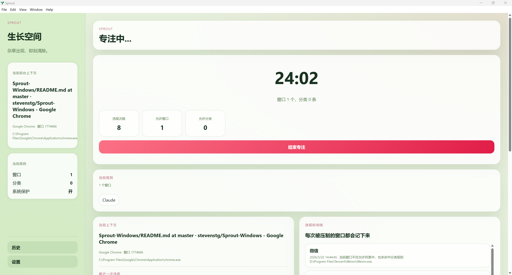
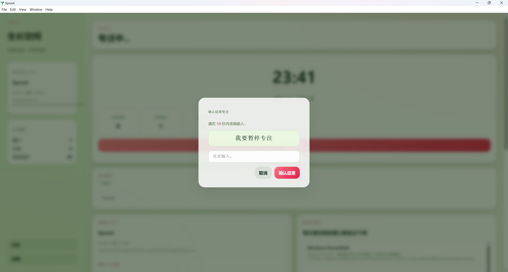

<div align="center">


# Sprout

**开始倒计时，专注之外的窗口一律消失。**

*界面设计参考 [网费很贵](https://github.com/sheepzh/time-tracker-4-browser) · 社区 [linux.do](https://linux.do)*

[](https://github.com/stevenstg/Sprout-Windows)
[](https://www.electronjs.org/)
[](LICENSE)

</div>


---

## 写在前面

如果你有过这样的经历——

- 打开VS Code准备写代码，十分钟后发现自己在刷B站
- 等AI回答的间隙，打开了知乎，半小时后才切回来
- 电脑同时打开了十几个窗口，注意力在不停地切换，无法建立完整、长时间的工作Session

那 Sprout 可能是给你做的。它尤其适合：

- **ADHD 或注意力难以集中的人** — 靠意志力抵抗分心很累，不如让程序来帮助你
- **多任务工作者** — 在家办公、独立开发、边写论文边查资料的学生
- **对自己的自制力不自信的人** — 知道该做什么，但是启动困难，在娱乐和学习中总是倾向前者

---

## 它做什么

会话开始后，Sprout 的守卫进程每 350ms 检查一次前台窗口。不在白名单里的窗口会被立刻最小化，并把焦点拉回到上一个允许的窗口。每次拦截计入违规记录，会话结束后生成 Markdown 摘要。



放行规则支持两个维度：

| 维度 | 适用场景 |
|------|----------|
| 窗口 | 固定工具，按当前窗口加入，适合临时想放行的窗口 |
| 分类 | 关键词匹配标题 / 进程名 / 路径，适合一类内容 |

浏览器内容的管控交给浏览器插件，例如`网费很贵/BlockSite`处理，Sprout 专注于桌面窗口层面的拦截，高度建议搭配浏览器插件使用Sprout。

## 快速开始
```bash
git clone https://github.com/stevenstg/Sprout-Windows.git
cd Sprout-Windows
npm install
npm start
```

Node.js 18+ 是唯一硬性依赖。详见 [Installation](docs/installation.md) 和 [Usage](docs/usage.md)。

## 其他

**系统安全白名单**：内置规则自动放行资源管理器、任务栏、开始菜单、锁屏、UAC、截图工具等系统窗口，避免误拦截。

**退出保护**：会话中点击结束会触发打字验证，防止冲动退出。难度可调整（固定短语 / 随机符号串 / 生僻汉字）。



**历史记录**：每次会话结束后自动写入 `%DOCUMENTS%\Sprout\history\YYYY-MM-DD.md`。

---

## 写在后面

作者本人算是一个 ADHD 患者，经常在多个任务之间切换，这严重影响着我的工作、学习和科研效率。学习时，不自觉地就把浏览器打开了，在各大网站冲浪一圈回来，往往已经过去好几分钟；在 AI 时代更是如此——等待 AI 回答的 5 分钟，是我度过的最快乐的一小时。

为了解决这个问题，我做出过许多尝试：

1. **Forest**（手机端种树）——有效，相当有效，但管不到电脑。
2. **网费很贵 / BlockSite**（浏览器插件）——同样有效，能限制我在知乎、B 站、小红书的停留，但终究只管浏览器里面。
3. **ActivityWatch**——有效，但主要是监测作用，帮我事后复盘时间去哪了，而非主动拦截。

Windows 端完全找不到开源免费的同类项目，为数不多的选择都是商业软件。于是，在 Vibe Coding 时代，我决定自己动手做一个——这就是 Sprout。

---

<div align="center">

如果 Sprout 帮你守住过一次专注，欢迎点个 Star ⭐

[](https://github.com/stevenstg/Sprout-Windows/stargazers)

有 bug 或想法？[开一个 Issue](https://github.com/stevenstg/Sprout-Windows/issues) · 欢迎 [Pull Request](https://github.com/stevenstg/Sprout-Windows/pulls)

</div>
