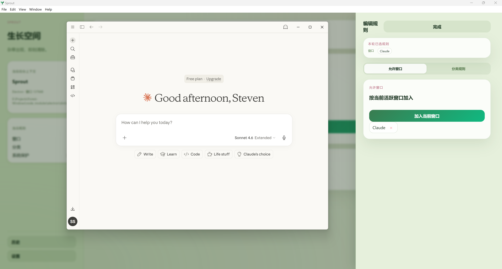
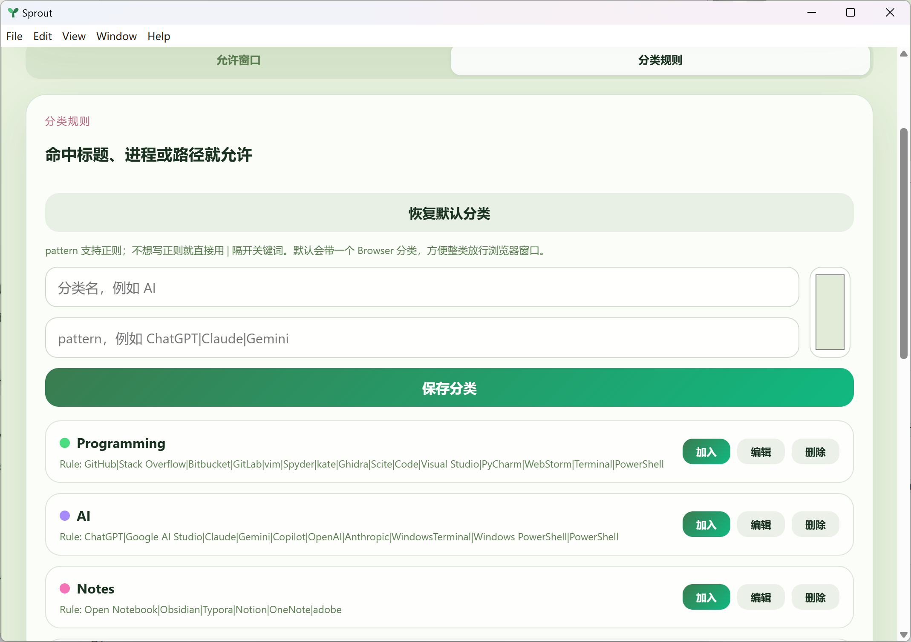

# Usage

## 基本逻辑

Sprout 的判断规则只有一条：**命中任意允许规则就放行**。

规则之间没有优先级，有一条匹配就够了。配置时最需要想清楚的是范围——你是想放行一个具体窗口，还是放行一类内容。口子开大了，Sprout 就没有意义了。

浏览器内容的管控不在 Sprout 的职责范围内，交给浏览器插件处理。Sprout 只做桌面窗口层面的拦截。

## 两种放行维度

### 允许窗口

把目标窗口切到前台，点击"加入当前窗口"，Sprout 按当前窗口加入，优先识别这个窗口本身。建议把目标窗口和 Sprout 并排放置，在目标窗口激活时点击"加入当前窗口"。



适合你需要一直留着的固定工具——VS Code、终端、PDF 阅读器。

优点是稳定可靠，缺点是粒度粗：窗口一旦放行，里面发生什么都算允许。

如果你把整个浏览器加进来，Sprout 就不会再区分浏览器里的具体内容，浏览器内部行为要完全交给插件处理。

### 分类规则

用 `|` 分隔关键词，命中窗口标题、进程名、路径任意一处即放行。

适合一类经常用的内容，比如 Programming、Paper、Comms。不想一个个加窗口时用分类更省事。代价是匹配是模糊的，关键词写宽了就容易误放。



## 分类关键词怎么写

一个常见的坑：

**关键词不要太短**：`Code`、`AI`、`Reader` 这类词出现在任何标题里都会命中，很容易带进不该放行的东西。用更具体的词替代，比如 `Visual Studio` 而不是 `Code`。

一套可以直接用的起始分类：
```
Programming
pattern: Visual Studio Code|PyCharm|WebStorm|vim|Spyder|Ghidra|SciTE|Cursor

AI
pattern: WindowsTerminal|PowerShell|cmd|Claude|Codex|Copilot|ChatGPT|Gemini

Notes
pattern: Obsidian|Typora|OneNote|Notion|Logseq

Paper
pattern: Zotero|Acrobat|SumatraPDF|论文

Office
pattern: Word|Excel|PowerPoint|WPS

Creative
pattern: Photoshop|GIMP|Inkscape|Premiere|剪映|Figma

Comms
pattern: 微信|WeChat|QQ|Slack|Teams|Discord|Telegram|飞书|Zoom
```

## 几个实用的配置思路

**写代码 + AI 辅助**：允许窗口放 VS Code，分类加 Programming 、AI和 Paper。

**需要大量查询资料，但担心娱乐窗口分心**：将浏览器放入白名单，具体内容由`网费很贵/BlockSite`插件实现控制。

**某个软件必须一直留着**：直接加窗口规则，最省事。

## 设置项说明

**历史记录目录**：每轮专注结束生成的 Markdown 写到这里。

**自动写 Markdown 历史记录**：开启后每轮结束自动落一份记录。

**启用系统安全白名单**：建议常开。资源管理器、开始菜单、截图工具等系统界面靠它兜底，关掉容易误伤。

- 如果关闭，有些系统界面会被错误屏蔽，极端情况下可能导致资源管理器、任务栏等系统界面状态异常，此时可在任务管理器中重启 Windows 资源管理器。

**退出验证难度**：简单（固定短语）、中等（随机符号串）、困难（生僻汉字）——越难越能防止冲动退出。

## 历史记录

每轮专注结束后自动生成 Markdown，记录开始 / 结束时间、计划与实际时长、违规次数、本轮规则配置、以及完整的违规时间线。适合复盘，但 Sprout 最核心的价值还是当场拦截。